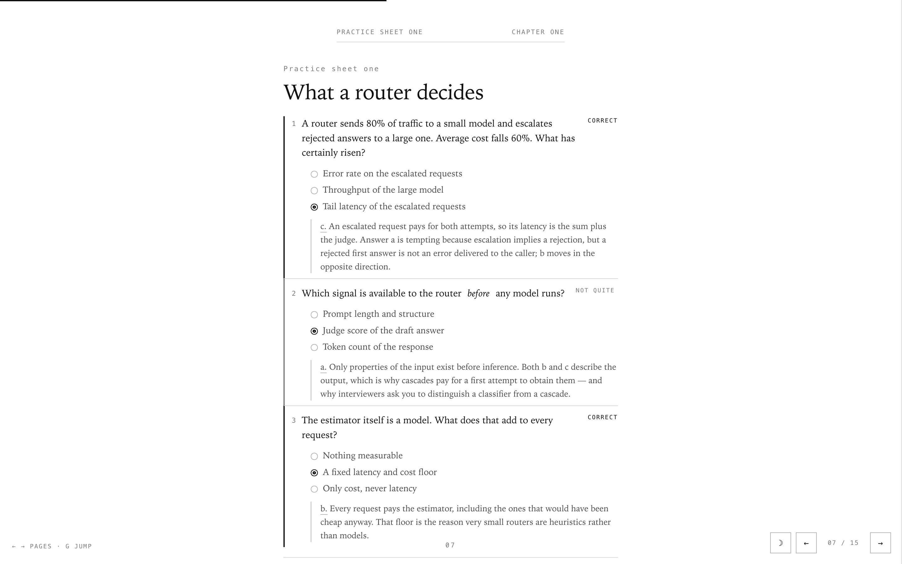
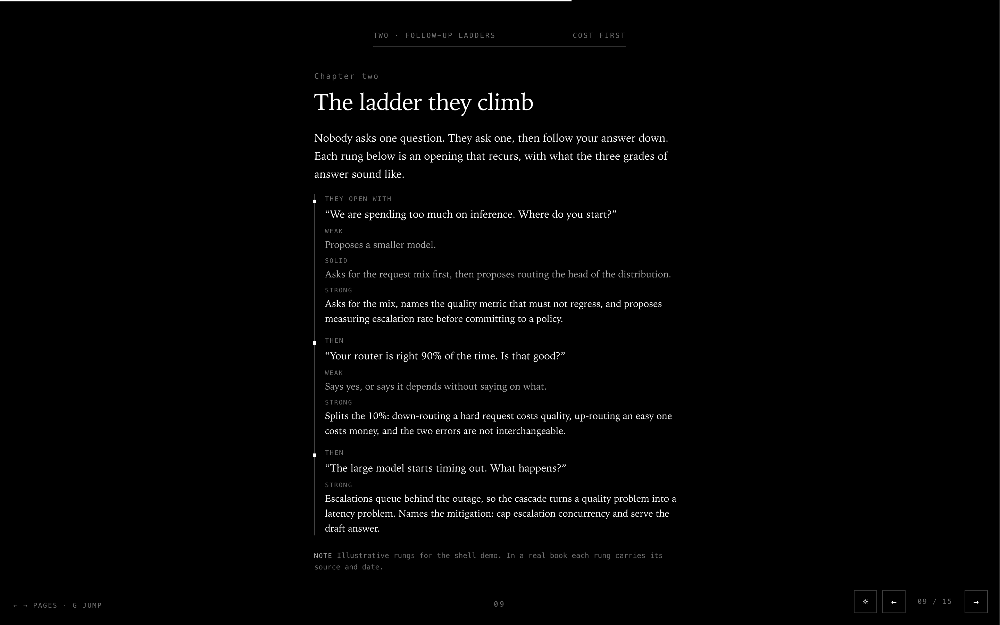
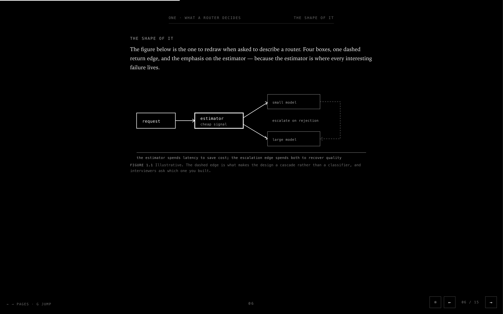
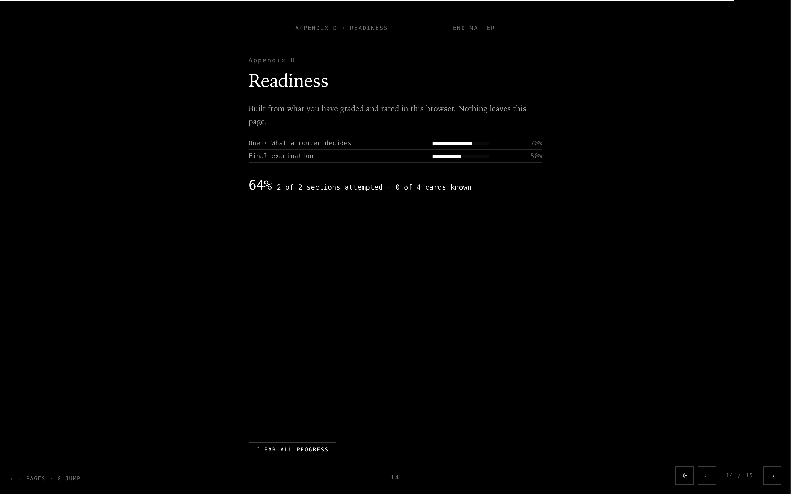

<h1 align="center">topic-to-book</h1>

<p align="center">
  Name a topic and a goal. Get an interactive, paginated book that teaches the theory,<br />
  drills you on it, and shows you how the topic is actually asked about in interviews.
</p>

<p align="center">
  <a href="#install"></a>
  <a href="LICENSE"></a>
  
  
  
</p>

<p align="center">
  <a href="#claude-code"></a>
  <a href="#codex-cli"></a>
  <a href="#cursor"></a>
  <a href="#opencode"></a>
  <a href="#any-other-agent"></a>
</p>

---

`topic-to-book` is a skill for coding agents. You ask for a book on a subject — "prep me for LLM
router interviews", "system design for a senior backend role", "teach me consistency models
properly" — and the agent researches the topic twice over, then writes a single self-contained
HTML file: theory from first principles, hand-drawn SVG figures, a practice sheet after every
chapter, the follow-up questions interviewers actually ask, annotated mock rounds, flashcards, a
self-scoring examination, and a readiness page that tracks what you have mastered and what you
have been avoiding.

The book is one file with no external requests. It opens in any browser, works offline, and
remembers your progress locally.

| | |
| --- | --- |
|  |  |
| **Practice sheets** after every chapter. Graded on the page, with explanations that say why the wrong answer was tempting. | **Follow-up ladders**: the opening question, where it goes next, and what weak, solid, and strong answers sound like. |
|  |  |
| **Figures you can redraw** on a whiteboard in sixty seconds. Hand-authored SVG, never Mermaid. | **A readiness page** built from your own grades and self-ratings, so you know which chapter to go back to. |

## What the book contains

- **Theory organized as problems, not definitions.** Every chapter opens with what breaks without
  the concept, because that is what you can reconstruct under pressure.
- **A practice sheet after every chapter**: graded questions whose distractors are things people
  actually believe, plus open drills you answer out loud and rate yourself on.
- **A chapter on how the topic is really interviewed** — question taxonomy with counts, verbatim
  phrasings, the failure signals interviewers name, and what the same question requires at mid,
  senior, and staff level.
- **Annotated mock rounds** with a built-in countdown, so you can practise talking for the clock.
- **Numbers with units and sources**, because the follow-up is always "compared to what, and where
  did you get that?"
- **Flashcards, a final examination, an answer key generated from the questions themselves, and a
  sources page** that says what is reported fact and what is inference.

Length follows the topic: roughly 50–80 pages for one narrow mechanism, 90–160 for a standard
interview topic, and 180–300 for a whole domain.

## Install

The installer copies the skill into the agent's skills directory. Nothing else is touched, and
there is no runtime dependency beyond Python 3 for the bundled scripts.

Every agent found on your machine, in one command:

```bash
curl -fsSL https://raw.githubusercontent.com/Atharva-Kanherkar/topic-to-book/main/install.sh | bash
```

### Claude Code

```bash
curl -fsSL https://raw.githubusercontent.com/Atharva-Kanherkar/topic-to-book/main/install.sh | bash -s -- --agent claude
```

Installs to `~/.claude/skills/topic-to-book`. For a single project instead, clone the repo and run
`./install.sh --project`, which installs to `./.claude/skills`.

### Codex CLI

```bash
curl -fsSL https://raw.githubusercontent.com/Atharva-Kanherkar/topic-to-book/main/install.sh | bash -s -- --agent codex
```

Installs to `~/.codex/skills/topic-to-book`.

### Cursor

```bash
curl -fsSL https://raw.githubusercontent.com/Atharva-Kanherkar/topic-to-book/main/install.sh | bash -s -- --agent cursor
```

Installs to `~/.cursor/skills/topic-to-book`.

### OpenCode

```bash
curl -fsSL https://raw.githubusercontent.com/Atharva-Kanherkar/topic-to-book/main/install.sh | bash -s -- --agent opencode
```

Installs to `~/.config/opencode/skills/topic-to-book`.

### Any other agent

The skill is a directory with a `SKILL.md` and four supporting files. Point any agent that can
read instructions from disk at it:

```bash
git clone https://github.com/Atharva-Kanherkar/topic-to-book.git
cd topic-to-book && ./install.sh --dir ~/path/to/your/agents/skills
```

If your agent has no skills directory, reference `SKILL.md` from whatever file it does read —
`AGENTS.md`, a rules file, a system prompt — and keep the repo on disk so the scripts and
references resolve.

## Use

Once installed, ask in plain language. The skill triggers on the intent, not on a keyword:

```
make me a book on LLM routers to prepare for a senior infra interview
prep me on consistency models — I have two weeks
I need to be grilled on system design, staff level
teach me CUDA memory hierarchies properly, with practice questions
```

The agent will ask at most one or two questions — usually your level and whether you are targeting
a specific company — then research and build. What comes back is an HTML file, or a published URL
if your agent can host artifacts.

To iterate: ask for another chapter, more questions on a weak area, or a harder examination. The
book is assembled from per-chapter fragments, so a chapter can be rewritten without touching the
rest, and the contents page renumbers itself.

## How it works

| Phase | What happens |
| --- | --- |
| 0 · Brief | Fix the scope, the goal, the level, the time available, and the page budget. |
| 1 · Topic research | Build the concept spine as problems rather than definitions; collect numbers with sources, real worked examples, and the misconceptions people actually hold. |
| 2 · Interview research | Find how the topic is really asked about: loops, verbatim questions, follow-up chains, failure signals, level calibration — weighed by source class and dated. |
| 3 · Plan | Parts, chapters, page counts, and where the sheets, ladders, mock rounds, and examinations fall. |
| 4 · Build | Write chapters as fragments against the shell; assemble them, with the contents page numbered from the assembled result. |
| 5 · Verify | Structural validation, then screenshots of the figure and sheet pages, because a label drifting outside its box is invisible in source. |

Phase 2 is the one that makes the output different from a textbook, and it is the one with the
strictest rules: no invented loops, no rubric with a company's name on it that nobody reported, and
a labelled gap where the research came up short.

## What is in the box

```
SKILL.md                          the instructions the agent follows
assets/book-shell.html            paging, both grounds, quiz engine, self-rating drills,
                                  flashcards, timer, readiness meter, jump palette
references/research-playbook.md   scoping, concept spine, sources, numbers, misconceptions
references/interview-intel.md     how to research the way a topic is actually interviewed
references/page-types.md          the fragment workflow and every component's markup
references/figure-patterns.md     SVG idioms: pipelines, trade-off axes, stacks, timelines
scripts/assemble_book.py          splice fragments into the shell, write the contents page
scripts/validate_book.py          pre-publish structural checks
scripts/shoot_pages.py            screenshot any page, in either ground, pre-graded
examples/routing-under-a-budget/  a short demo book and the fragments it was built from
```

The scripts are usable on their own:

```bash
python3 scripts/assemble_book.py chapters/ -o book.html --title "The Title" --book-id topic-slug
python3 scripts/validate_book.py book.html
python3 scripts/shoot_pages.py book.html --out shots --pages 7 --theme light --graded
```

`validate_book.py` fails the build on the mistakes a reader notices immediately: a contents page
whose numbers drifted, a question whose correct answer is not among its options, two questions
sharing a radio group, a chapter that never got a practice sheet, a colour that is not greyscale,
Mermaid, or a placeholder that survived into the finished file.

## The example

[`examples/routing-under-a-budget/`](examples/routing-under-a-budget) holds a short demo book and
the six fragment files it was assembled from. It exercises every page type and component; its
content is illustrative rather than researched, and its sources page says so. Open `book.html` in
a browser, or read the fragments to see the markup a chapter is made of.

## Design constraints

These are deliberate, and the validator enforces most of them.

- **Paginated, not scrolling.** One page fills the viewport; arrow keys, buttons, or a swipe turn
  it. Pagination forces brevity, and brevity is why the format reads well.
- **Strictly greyscale, in two grounds.** No accent hue, and a toggle that remembers your choice.
  Every figure stays legible on black and on white.
- **Hand-authored SVG figures, never Mermaid.** A layout engine cannot put the box where the
  argument needs it, and in a book placement carries meaning.
- **Progress stays local.** Grades, self-ratings, and card marks live in `localStorage`. Nothing
  is sent anywhere; there is nothing to send it to.
- **One file.** No CDN, no fonts to fetch, no build step to read it.

## Honesty rules

A study book that invents its facts is worse than no book, because the reader cannot tell which
parts to trust. So the skill requires that:

- every number carries a unit, a source, and a date;
- no interview loop, rubric, or company-attributed question is written without a source, and the
  number of accounts a claim rests on is stated;
- inference is labelled as inference, in the caption where it appears;
- the sources page names the research month, because loops get rewritten and fast-moving topics
  drift within a quarter;
- if the agent had no research tools available, the book says so rather than filling the gap.

## Requirements

- **Python 3.9+** for the bundled scripts. No packages to install.
- **Web search and fetch tools** in the agent session for phase 2. Without them the book still
  builds, and says on its sources page that the interview chapters are unsourced.
- **Chrome, Chromium, or Edge**, only for `shoot_pages.py`.

## License

MIT. See [LICENSE](LICENSE).
